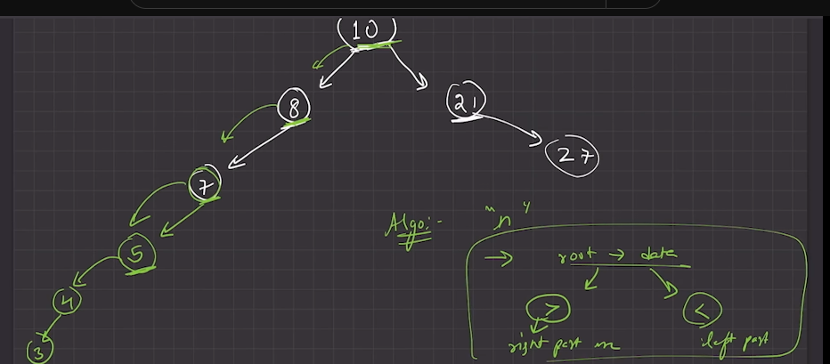
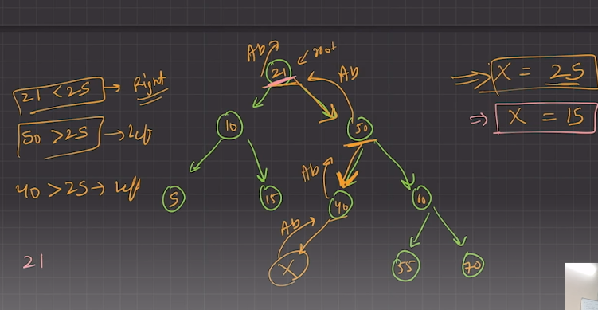
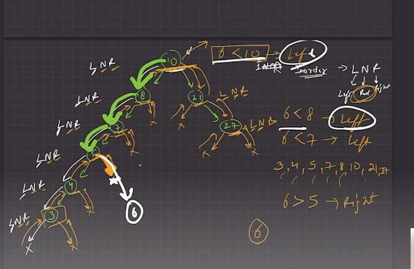

A **Binary Search Tree (BST)** is a type of binary tree where each node has at most two children, referred to as the left child and the right child. The tree is structured according to the following properties:

1. **Node Property**:
   - Each node contains a key (or value), and optionally additional data.

2. **Left Subtree Property**:
   - The left subtree of a node contains only nodes with keys less than the node's key.

3. **Right Subtree Property**:
   - The right subtree of a node contains only nodes with keys greater than the node's key.

4. **Recursion Property**:
   - Both the left and right subtrees must also be binary search trees.

**Example**:
```
      10
     /  \
    5   20
   / \   / \
  3   7 15  25
```


# 1) Logic For Making A Binary Search Tree:

`10 8 21 7 27 5 4 3 এর জন্য BST(Binary Search Tree) কেমন হবে তা দেখবো ।`

`Root এর থেকে বড় হলে Right Side । `

`Root এর থেকে বড় হলে Left Side । `

<br>


<br>


# 2) Traversal (like: BInary Tree):

- `Level Order.`
- `In-Order.`
- `Pre-Order.`
- `Post-Order.`


<br>

# 3)  Find element is BST:

## `A element present in BST OR Not? `

`25 Search করবোঃ প্রথমে, 25 Root(21) এর থেকে বড় তাই, Right Side এ যাবো । 50 থেকে 25 ছোট Left Side এ যাবো। 40 থেকে 25 ছোট Left Side এ যাবো। কিন্তু,Left Side এ তো NULL আছে । অর্থাৎ, 25 এই BST এ নাই । Simillary, 15 এর টা বের করো ।   `

<br>


<br>


## `**Find Element in BST** ALSO **location and previous location** `

Let's find a value exists in our tree or not. We will iterate through our tree to find the location and previous location of whatever we search for. So if our location is NULL we can just go ahead and use that information while inserting.


# 4) Insert New Node into BST:

`Binary Search এর মতো এখানে complexity হয় O(log n) ।`

`ধরি, 6 insert করবো এক্ষেত্রে, এর সাথে করে দেখবো ছোট নাকি বড় । তার পর যে কোন একপাশে যাবো, সেখানে আবার একই ভাবে করবো । অর্থাৎ, আমরা একপাশে কাজ করতেছি অন্য পাশে করতেছি। অনেকটা Binary Search এর মতো। তাই, এখানেও complexity হয় O(log n) । `

<br>


<br>


<iframe src="" width="800px" height="2100px"></iframe>

<embed src="path/to/yourfile.pdf" width="800px" height="2100px" />


