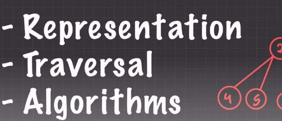
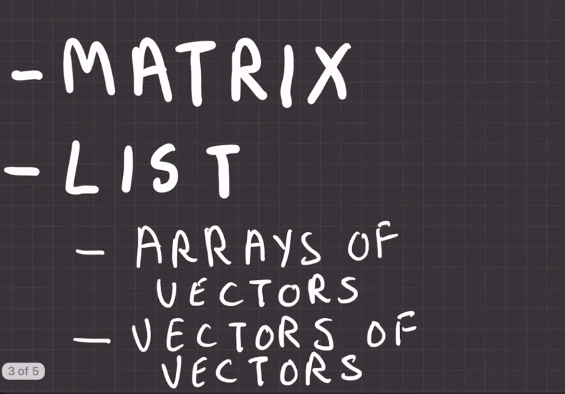
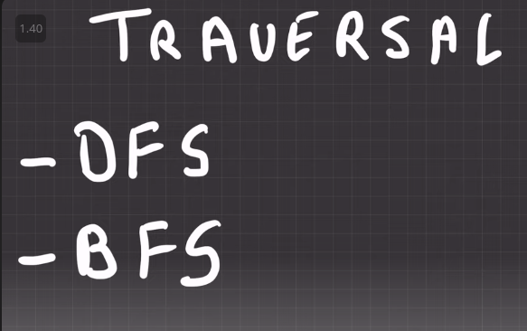

### We will cover this tree part:

---

### Representation:

- Competitive Programming এ সাধারণত এ প্রশ্ন খুব কম আসে ।
- List আকারে অনেক বেশি প্রশ্ন আসে । 
    - cpp তে list হিসেবে `Arrays of Vector` and `Vectors of vectors` ব্যবহার করি আমরা । 

---

### Travesal

`Mainly দুইটা algorithrm ব্যবহার করি । আর গুলো এইখানে থেকেই আসে।`

- **DSF** `Depth-First Search`

- **BSF** `Breadth-First Search`

---

