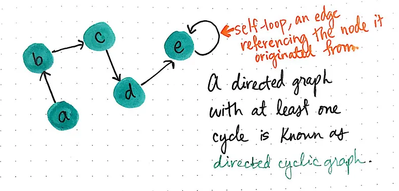
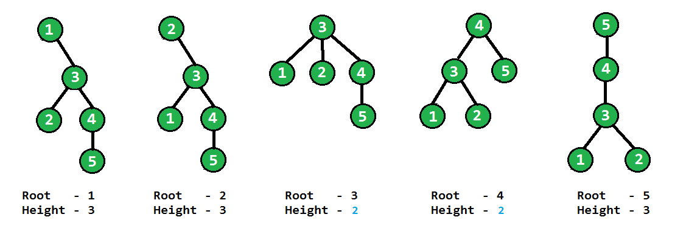
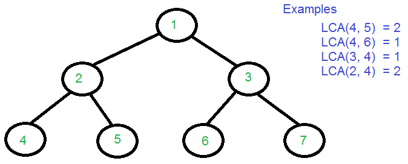

---

# Vertex and Edges:

---

# Directed Graph and UnDirected Graph:

---

# Graph and Tree:

 

`যেই গ্রাফে কোন Cycle নেই তাকে Tree বলে । `

 

---

# Cyclic Graph and Acyclic Graph:

---

# Height of tree : 

---

# LCA (Lowest Common Ancestor)

`LCA -> Common Parent.`

---
