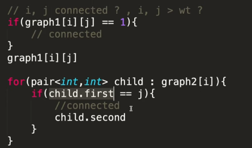

---

# we use adjacency matrix or adjacency list to show a graph in code:


- `যত গুলো vertex আছে তত বাই তত একটা matrix বানাবো ।`

- `matrix [i] [j]  যদি তারা নিজেদের মধ্যে  connected থাকলে, তাহলে ১, না হলে ০ দিব । `

- `In the given example we are seeing a undirected graph. That's why consider, 0->1, 1->0 both .`

### Example with directed Graph:


<br> <br>

### যদি গ্রাফের edge বা weight এর ভ্যালু দেওয়া থাকলে (like: neural network) তাহলে ম্যাট্রিক্স এ সেই ভ্যালু করে দিব । 


---

# নিচে একটা গ্রাফ আছে ।
- ` প্রথম দুইটা সংখ্যা (6,9) বুঝায়ঃ (6->vertex and 9->edges ) `
- ` পরের সংখ্যা গুলো বুঝায় কার সাথে কে  connected আছে । ` 


#### উপরের গ্রাফটিকে কোডের মাধ্যমে implement কর । 

```cpp

#include<iostream>
using namespace std;

#define yasin {ios_base::sync_with_stdio(0);cin.tie(0);cout.tie(0);}

const int N = 1e4;
int graph[N][N];

int main(){
    yasin
    int m,n;cin>>m>>n;

    //_________Input of the graph____________
    for(int i=0;i<m;i++){
        int v1,v2;cin>>v1,v2;
        graph[v1][v2] = 1;
        graph[v2][v1] = 1;
    }
    //_________Output of the graph____________
    for(int i=0;i<m;i++){
        for(int j=0;j<m;j++){
            cout<<graph[i][j];
        }
        cout<<endl;
    }
}

/*
Input:
6 9
1 3
1 5
3 5
3 4
3 6
3 2
2 6
4 6
5 6
*/

```

` কিন্তু এইখানে সমস্যা হচ্ছে space complexity অনেক বেশি । আমরা cpp তে 2D array এর ক্ষেত্রে maximum (1e4*1e4)এর 2D array বানাতে পারি । আমাদের graph অনেক বেশি বড় হলে আমরা adjacency matrix দিয়ে সেই graph কে represent করতে পারবো না । তাই, আমাদের দরকার  adjacency list । `


<br>

`এইখানে, আমরা আমাদের একটা graph  যত গুলো vertex থাকবে তত গুলোর list বানাবো । প্রত্যেক লিস্টে একটা vertex এর কোন কোন vertex এর সাথে যুক্ত আছে তার আর একটা লিস্ট তৈরি করবো । `

<br>

```cpp

#include<iostream>
#include<vector>
using namespace std;

#define yasin {ios_base::sync_with_stdio(0);cin.tie(0);cout.tie(0);}

const int N = 1e5;
vector<int> graph[N];

int main(){
    yasin
    int n,m;cin>>n>>m;
    for(int i=0;i<n;i++){
        int v1,v2;cin>>v1>>v2;
        graph[v1].push_back(v2);
        graph[v2].push_back(v1);
    }

      // Output
    for(int i=0;i<n;i++){
        cout << "----->"<< i << ": ";
        for(int j : graph[i]){
            cout << j << " ";
        }
        cout << endl;
    }
}

/*
Input:
6 9
1 3
1 5
3 5
3 4
3 6
3 2
2 6
4 6
5 6
*/
```

---


# এখন, আমরা একটা গ্রাফ কে adjacency matrix আকারে কীভাবে ইনপুট নিব যদি weight দেওয়া থাকে । 


`আগের মতোই কিন্তু শুধু ১ এর পরির্বতে weight টা দিয়ে দিব । `


```cpp
/*
input:
6 9
1 3 4
1 5 3
3 5 2
3 4 7
3 6 8
3 2 9
2 6 1
4 6 2
5 6 3
*/

int m,n;cin>>n>>m;

    //_________Input of the graph____________
    for(int i=0;i<m;i++){
        int v1,v2,wt;cin>>v1>>v2>>wt;
        graph[v1][v2] = wt;
        graph[v2][v1] = wt;
    }

```

# এখন, আমরা একটা গ্রাফ কে adjacency list আকারে কীভাবে ইনপুট নিব যদি weight দেওয়া থাকে । 

```cpp
/*
input:
6 9
1 3 4
1 5 3
3 5 2
3 4 7
3 6 8
3 2 9
2 6 1
4 6 2
5 6 3
*/

int m,n;cin>>n>>m;

    //_________Input of the graph____________
    for(int i=0;i<m;i++){
        int v1,v2,wt;cin>>v1>>v2>>wt;
        graph[v1][v2] = wt;
        graph[v2][v1] = wt;
    }

```

---

# সুবিধা ও অসুবিধাঃ 



- `Adjency matrix দিয়ে এ যেকোন দুইটা edge connected আছে কি না তা  0(1) complexity দেখতে পারবো ।`
- `Adjency list দিয়ে এ যেকোন দুইটা edge connected আছে কি না তা  0(n) complexity দেখতে পারবো ।`

` Same for find the weight of the graph . `


