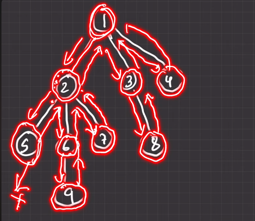
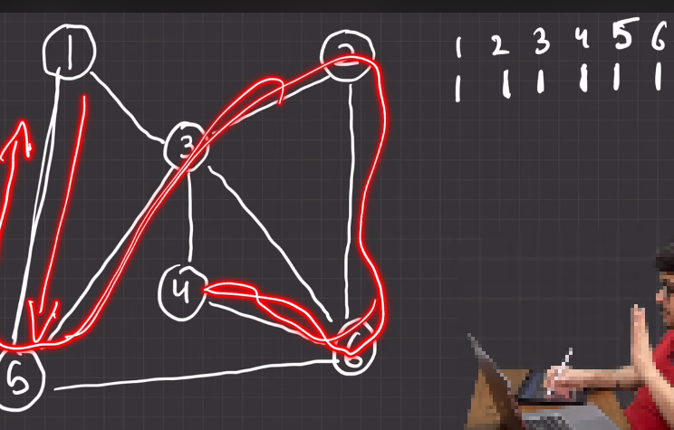
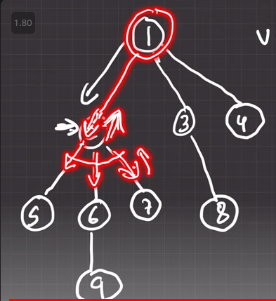

---

# DFS (Depth First Search:)

---

### What is DFS:

`Depth-first search (DFS) is a graph traversal algorithm focusing on exploring as deeply as possible along each branch before backtracking, commonly used for pathfinding and graph analysis. Its main theme revolves around systematic exploration of graph structures, emphasizing depth-first traversal over breadth-first search.`

---

# DFS in `tree`:

`Tree এর ক্ষেত্রে, আমরা Tree এর প্রত্যেক branch এর একদম Depth এ যাবো গিয়ে উপরের ছবিতে যেমন টা দেখানো হচ্ছে তেমন ভাবে element গুলো print করবো । এখন, শুরুতে আমরা  root node 1 এ যাবো তারপর 1 এর  child 2 তে যাবো কিন্তু, আমরা যখন 2 তে থাকবো তখন তো 2 এর জন্য 1 একটা হবে child node । 2 থেকে যেন আবার আমরা 1 বা ফিরে না যাই এটা করার জন্য আমরা "visited" array বানাবো array এর size হবে total node এর সমান । যেইখানে, আমরা tree  এর কোন child গুলোকে visite  করেছি তার তথ্য থাকবে ।`

---

# DFS in `Graph`:

`graph এ তো tree এর মতো কোন root node নেই । এখানে, প্রথমে আমরা যেকোন একটাকে root বা source হিসেবে ধরবো । তারপর "visited" array বানাবো তারপর যেই element কে প্রিন্ট করবো "visited" array তে সেইটা কে ১ মার্ক করে দিব । যখন, সব গুলো visited হয়ে যাবে তখন আমরা আবার root এ ফিরে গেলে search করা বন্ধ করে দিব । `

- for visulize visit this page: [page_link](https://visualgo.net/en)

---

# code:

### আমরা উপরের গ্রাফটা (যেইটা দিয়ে DFS in `Graph` ব্যাসিক দেখেছিলাম) সেইটা দিয়ে DFS implement করবো । 

আমাদের এইখানে,  
- `আমরা যখন root node (১) থেকে child node (২) গিয়েছি অর্থাৎ একটা operation complete হবে ।`
-` তারপর child node গুলোতে আরেকটা operation complete হবে । ` 
-` তারপর child node গুলো থেকে exit হওয়ার সময় আরেকটা operation complete হবে । ` 

