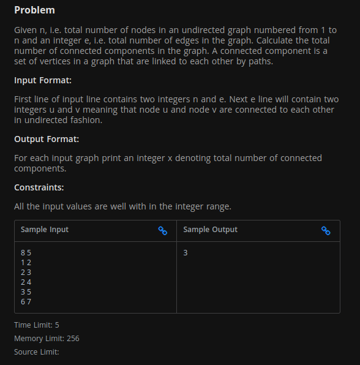
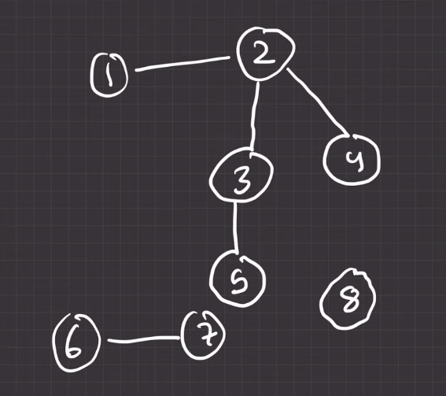

--- 

- # dfs ব্যবহার করে কীভাবে একটা `Undirected graph` এর connected component গুলো বের করতে হয় । 

- # dfs ব্যবহার করে কীভাবে একটা `Undirected graph` এর cicle বের করতে হয় । 

--- 

# Connected Component in a graph:

`problem statement:`

[problem_link](https://www.hackerearth.com/problem/algorithm/connected-components-in-a-graph/)

graph:  

`এখানে, উপরের গ্রাফে আমরা একটা unvisited note এ dfs চালাবো । যেইটা আমাদের যতগুলো  unvisited note আছে তাদের সবাই কে visited mark করবে। এখন, যতবার dfs চলবে ততবারই হবে Total Number of Connected Component. `

