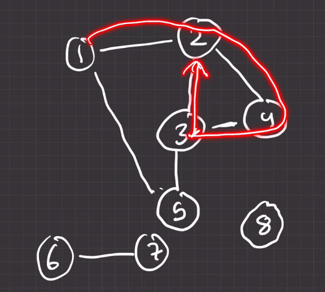

--- 

- # dfs ব্যবহার করে কীভাবে একটা `Undirected graph` এর connected component গুলো বের করতে হয় । 

- # dfs ব্যবহার করে কীভাবে একটা `Undirected graph` এর cicle বের করতে হয় । 

--- 

# Connected Component in a graph:

` Question NO: 01 problem statement:`


[problem_link](https://www.hackerearth.com/problem/algorithm/connected-components-in-a-graph/)

graph: <br>


`এখানে, উপরের গ্রাফে আমরা একটা unvisited note এ dfs চালাবো । যেইটা আমাদের যতগুলো  unvisited note আছে তাদের সবাই কে visited mark করবে। এখন, যতবার dfs চলবে ততবারই হবে Total Number of Connected Component. `


```cpp

# include<iostream>
#include<vector>
using namespace std;

#define yasin {ios_base::sync_with_stdio(0);cin.tie(0);cout.tie(0);}

const int N = 1e5;
vector<int> g[N];
bool vis[N];

void dfs(int vertex){
    vis[vertex] = true;
    for(int child: g[vertex]){
        if(vis[child]) continue;
        dfs(child);
    }
}


int main(){
    int n,e;cin>>n>>e;

    for(int i=0;i<e;i++){
        int v1,v2;cin>>v1>>v2;
        g[v1].push_back(v2);
        g[v2].push_back(v1);
    }

    // how many time dfs called:
    int ct = 0;
    for(int i=1;i<=n;i++){
        if(vis[i]) continue;
        dfs(i);
        ct++;
    }

    cout<<"nuber of connected component: "<<ct<<endl;

}

```

<br> <br>

`Question NO: 02` <br>

`Problem statement 02: আমাদের যেই connected component গুলো আছে সেই গুলো vector এ store করে output দেখাও । `

```cpp

/*
    show all the connected component in a graph:
*/

#include<iostream>
#include<vector>

using namespace std;

const int N = 1e5;
vector<int> g[N];
vector<vector<int>> connceted_component;
vector<int> temp;
bool vis[N];


void dfs(int vertex){
    vis[vertex] = true;
    temp.push_back(vertex);
    for(int child : g[vertex]){
        if(vis[child]) continue;
        dfs(child);
    }
}

int main(){
    int n,e;cin>>n>>e;
    for(int i=0;i<e;i++){
        int v1,v2;cin>>v1>>v2;
        g[v1].push_back(v2);
        g[v2].push_back(v1);
    }

    int ct = 0;
    for(int i=1;i<=n;i++){
        if(vis[i]) continue;
        temp.clear();
        dfs(i);
        connceted_component.push_back(temp);
        ct++;
    }
    cout<<connceted_component.size()<<endl;
    for(auto i : connceted_component){
        for( auto k : i){
            cout<<k<<" ";
        }
        cout<<endl;
    }

}
```

<br> <br>

---

# cicle থাকলে তা কীভাবে বের করতে হয় 



`উপরের গ্রাফে একটা circle আছে । সেই circle কে detect করার সময় আমরা যখন আমরা node (3) তে আসবো তখন node (3) এর দুই পাশে node(2) আর node(4) দুইটা visited নোড আছে । এখন, আমরা parent node track রাখবো ৩ এ আসার সময় তার parent কে ছিল । যদি আমাদের সামনে এমন কোন node আছে যেইটা visited(remember visited),কিন্তু,  parent না তাহলে আমরা বলতে পারবো circle আছে ।`

# code: 

```cpp


#include<iostream>
#include<vector>
using namespace std;
const int N = 1e5;
vector<int> g[N];
bool vis[N];

bool dfs( int vertex,int par ){
    vis[vertex] = true;

    // first we say there is no loop exist
    bool isLoopExist = false;

    for(int child : g[vertex]){
        if (vis[child] && child==par) continue;
        if(vis[child]) return true;

        /*
        আমাদের প্রত্যেক node or vertex check  করবে যে লুপ আছে কিনা তাই যেকোন একটা vertex যদি 
        true return করে তাহলে overall, result তো true হবে । 
        */
        //  |= or is equal to 
        isLoopExist |= dfs(child,vertex);
    }
    return isLoopExist;
}


int main(){
    int n,e;cin>>n>>e;
    for(int i=0;i<e;i++){
        int v1,v2;cin>>v1>>v2;
        g[v1].push_back(v2);
        g[v2].push_back(v1);
    }

    bool isLoopExist = false;
    for(int i=1;i<=n;i++){
        if(vis[i]) continue;
        if(dfs(i,1)){
            isLoopExist = true;
            break;
        }
    }

    cout<<isLoopExist<<endl;
}

/*
input:
8 5
1 2
2 3
2 4
3 5
6 7
*/

```

<br> <br>

## practice question LinK:
[question_link](https://www.geeksforgeeks.org/problems/detect-cycle-in-an-undirected-graph/1)


