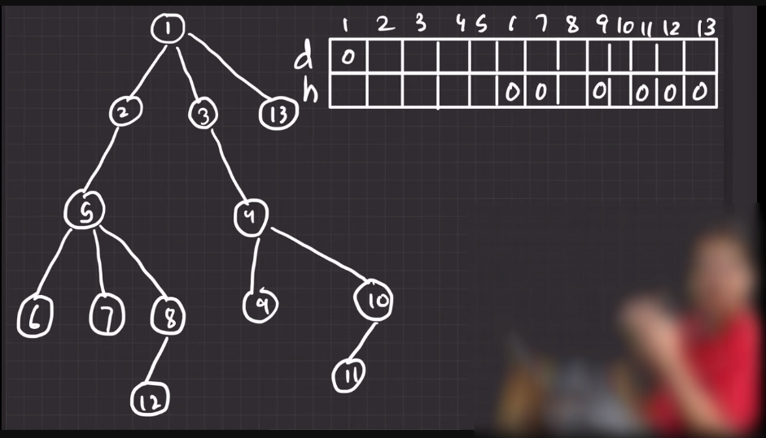

---

# Height and Depth of a TREE:

---


# DFS For Tree:

`এই ক্ষেত্রে আমাদের visited array এর দরকার হয় না। কিন্তু, আমরা যেন parent এর loop না পড়ে যায় সেইজন্য আমরা parent pass করবো dfs funtion এর মধ্যে  `

```cpp
#include<iostream>
#include<vector>
# define yasin {ios_base::sync_with_stdio(0);cin.tie(0);cout.tie(0);}
using namespace std;
const int N = 1e5;
int depth[N],height[N];
vector<int> graph[N];


void dfsTree(int vertex, int par=0){
    // 4 section fisrt 2 entering(vertex,node) last 2 existing(child,vertex)

    // section 1
    cout<<"Parent: "<<par<<" "<<"vertex: "<<vertex<<endl;

    for(int child:graph[vertex]){
        //section 2
        if(child==par) continue;
        dfsTree(child,vertex);
        //section 3
    }

    //section 4
}
int main(){
    yasin
    int n;cin>>n;
    for(int i=0;i<n;i++){
        int v1,v2;cin>>v1>>v2;
        graph[v1].push_back(v2);
        graph[v2].push_back(v1);
    }
    dfsTree(1);
}


/*
input for a tree:
13
1 2
1 3
1 13
2 5
3 4
5 6
5 7
5 8
8 12
4 9
4 10 
10 11
*/

```

---


# height and depth :


---

`আমরা জানি, `

- `depth হচ্ছে root node থেকে কত নিচে আছি । `

- `height হচ্ছে সর্বশেষ leaf node থেকে সেই particular node টি কত উপরে আছে । `



`কোন Tree দেওয়া থাকলে default ভাবে আমরা, উপরের ছবির উপরে যেই নিয়ম দেওয়া আছে সেইটা maintain করে ছবির মতো দুইটা array তে depth  and height fill  করবো । অর্থাৎ, ১ এর ক্ষেত্রে, depth হচ্ছে ০ কারণ এর উপরে আর কোন node নেই । আর ৬,৭,১২,৯,১১ এইদের ক্ষেত্রে  height হচ্ছে ০ কারণ, এদের নিচে আর কোন node নেই । `

```cpp
 // sectction1
    for(int child:graph[vertex]){
        //section 2
        depth[child] = depth[vertex] + 1;
        if(child==par) continue;
        dfsTree(child,vertex);
        //section 3
        height[vertex] = max(height[vertex],height[child]+1);
    }
```

`অর্থাৎ, আমরা যখন, vertex থেকে নিচের দিকে যাবো তখন আমরা আগের depth এর সাথে ১ যোগ করে দিব ।  depth[child] = depth[vertex] + 1; । আর height এর ক্ষেত্রে, উপরের ছবিতে ৮ এর height আমরা ১২ এর height থেকে পাবো । আবার, ৫ এর height আমরা ৬,৭,৮ থেকে পাবো । আমরা করতে পারি যে, ১২ এর height তো শূন্য আর ৮ এর height, বের করার সময় আমরা ৮ এর child এর সাথে আমরা ১ যোগ করবো  অর্থাৎ, **depth[child] = depth[vertex] + 1;**  আর ৫ এর ক্ষেত্রে ৬,৭,৮ এদের maximum হবে ৫ এর height । অর্থাৎ, **depth[child] = max(height[vertex],height[child]+1);** `


