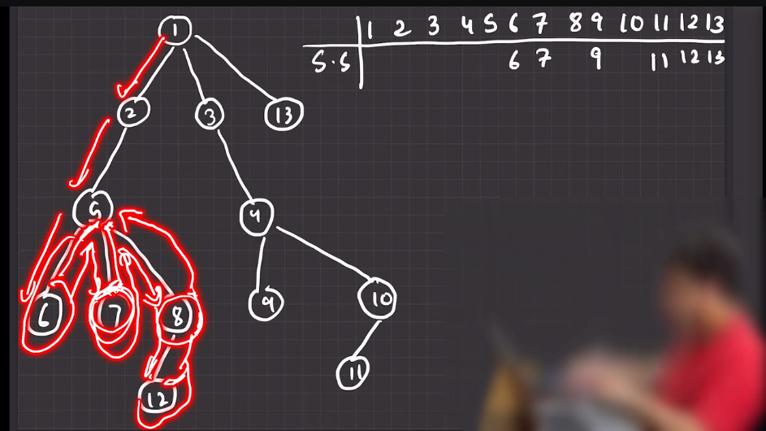

---

# Sub Tree Sum: 

---

` Sub Tree Sum বের করার জন্য Leaf node এর ক্ষেত্রে শুরুতে  sum হবে  Leaf node এ যেই number টা থাকবে সেইটা । 8 এর জন্য 12 থেকে উপরে উঠার সময় 12 এর সাথে 8 যোগ করে দিলে আমরা 8 এর Sub Tree এর Sum পাবো । 5 এর জন্য 5 এর যত গুলো child আছে (6,7,8) সব গুলো যোগ করবো তারসাথে 5 কে যোগ করবো । ` 

