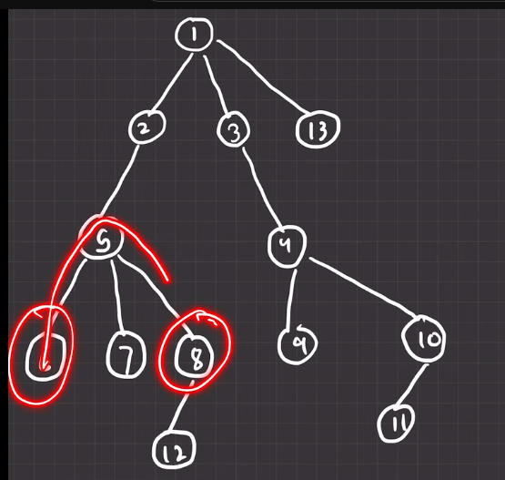
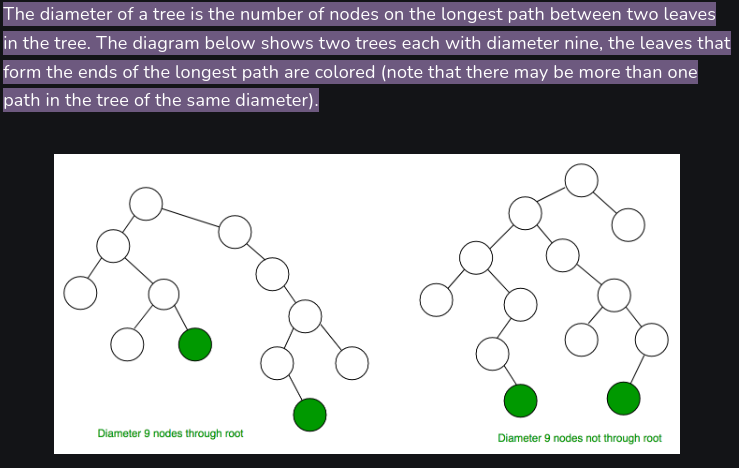

---

# Diameter of a tree

---

` Diameter of a tree হচ্ছে tree এর  দুইটা যেকোন নোড এর মধ্যর্বতী কত গুলো edge আছে (maximum) সেই নাম্বার । উপরে 6 আর 8 এর জন্য  Diameter হচ্ছে 2 । যেহেতু আমাদের দুইটা নোড এর মধ্যর্বতী দুরত্ব বের করতে হবে তাই Diameter হবে নিচের চিত্রের মতো । `

`আমরা আগে depth বের করা শিখেছি । শুরুতে, আমরা প্রথমে যেকোন একটা node থেকে depth calculation করবো । তারপর, সেই node থেকে আমরা maximum যেই depth পাবো সেইটা node থেকে আবার আমরা depth calculation করা শুরু করবো আগের depth array কে শূন্য ধরে । তখন আমরা যেই ans পাবো সেইটাই হচ্ছে  Diameter of a tree ।  `

