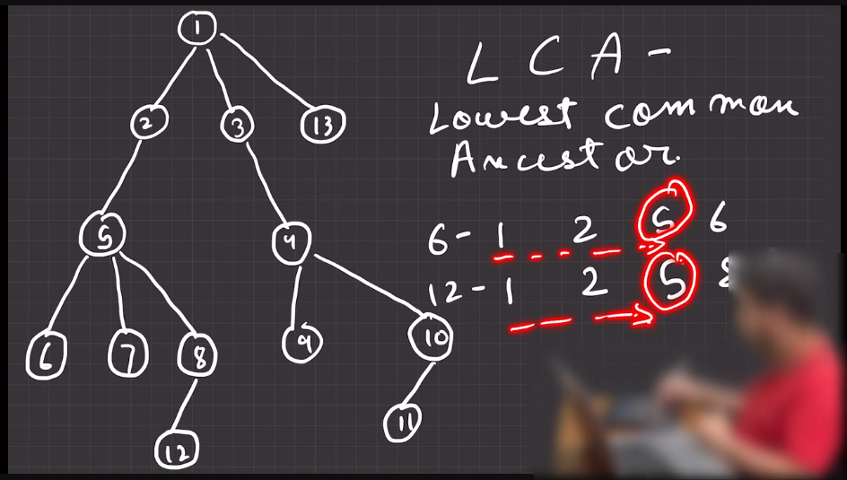

---

# Lowest Common Ancestor

---

` যখন দুইটা node  এর parent common থাকবে তখন তাদের বলা হবে Ancestor । উপরের ছবিতে, 6,7 এর common parent গুলো হচ্ছে 1,2,5 আর Lowest Common Ancestor হচ্ছে সবচেয়ে যেই parent  অথবা Ancestor টা কাছাকাছি থাকবে । 6,7 এর জন্য  Lowest Common Ancestor হচ্ছে 5 । একই ভাবে 6,12 এর জন্য  Lowest Common Ancestor হচ্ছে 5 ।   `

`6 and 12 এর জন্য আমরা বের করবো এর জন্য দুইটা array তে এদের path(root node থেকে কোন কোন node cross করে তারা 6 and 12 এ পৌচ্ছাছে) store করবো । তারপর সেই array এর সামনের দিকে মিলাতে মিলাতে যাবো সবচেয়ে শেষে যেই array এর element টা মিলবে সেইটায় হবে ans. `

