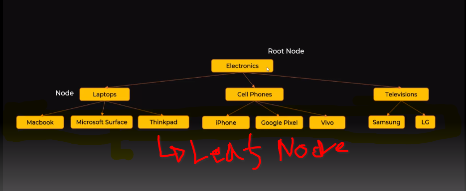
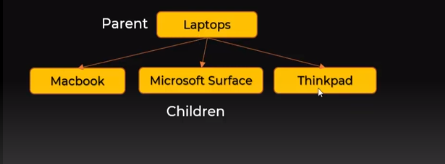
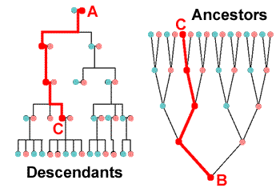
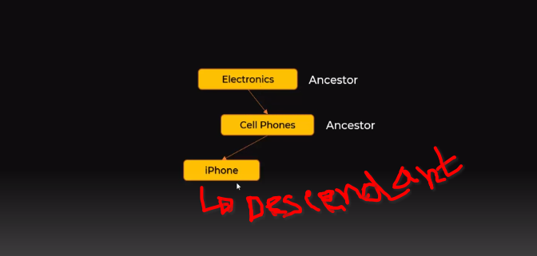
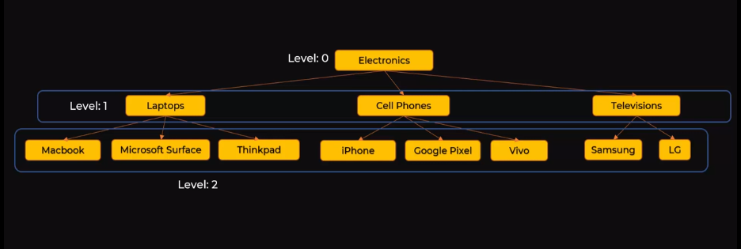

# Tree (General Tree)

---

Already we have read about the **Basic term of a tree:** Here just a overview. 

---

- **root node** , **node** and **leaf node**

- **parent node** , **child node**

- **ancestors** , **descendants**

- **level**

