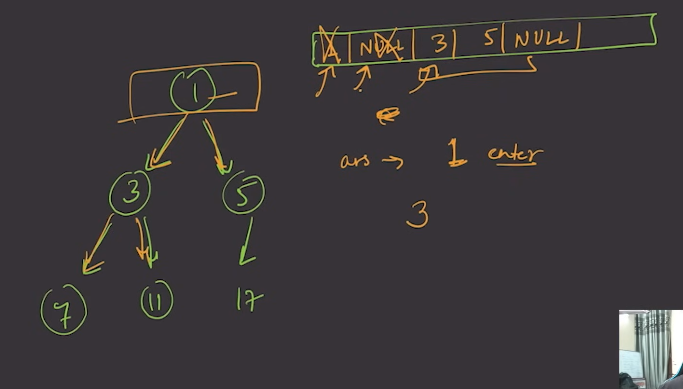
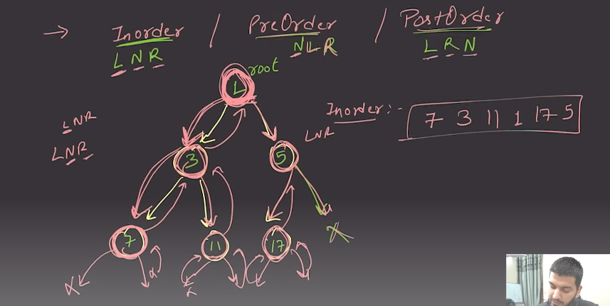
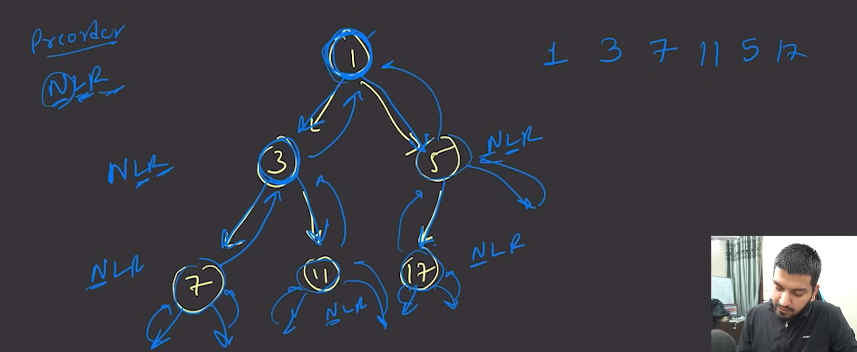
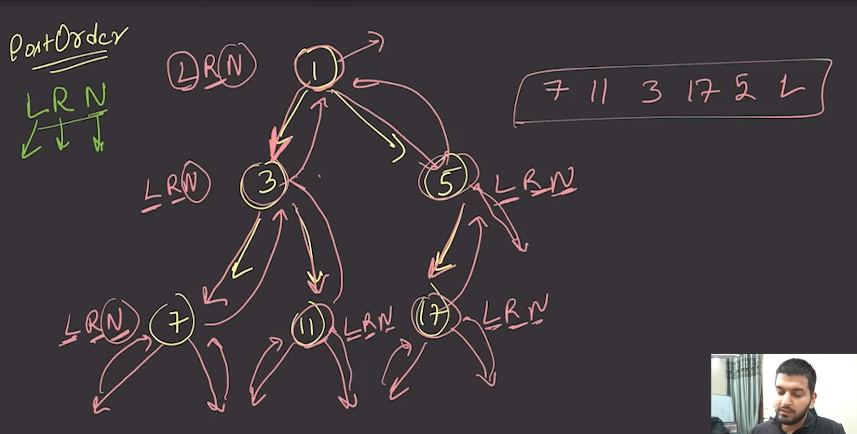

# 1) Visualized Binary Tree:

```
        1
       / \
      3   5
     / \  /
    7  11 17
```
<br>

---
---
---

<br>


# Lavel order traversal:

In a **level order traversal** of a binary tree, we visit the nodes level by level from top to bottom and from left to right within each level.

Given the binary tree:

```
        1
       / \
      3   5
     / \  /
    7  11 17
```

### Level Order Traversal with Specifiers:

1. **Level 1**: 
   - Nodes: `1`

2. **Level 2**: 
   - Nodes: `3`, `5`

3. **Level 3**: 
   - Nodes: `7`, `11`, `17`

`আমরা একটা queue বানাবো তারপর শুরুতে  temp নামক ভ্যারিএবল এ রুট নিব । রুট কে queue এ পুস করবো । এর পর queue থেকে থেকে প্রিন্ট করবো । এর পর প্রিন্ট করা element কে queue থেকে বাদ দিব । ভ্যারিএবল থেকে রুটের left and right এ যাবো ।  `

<br>


<br>


### Output:

```
Level 1: 1
Level 2: 3, 5
Level 3: 7, 11, 17
```

<br>

# Here are the pre-order, post-order, and in-order traversals for the given binary tree:

### 1. **In-order Traversal** (Left, Node(Root), Right):
In in-order traversal, we recursively do an in-order traversal of the left subtree, visit the root node, and finally do an in-order traversal of the right subtree.

<br>


<br>

- **Steps**:
  - Traverse the left subtree (`7 -> 3 -> 11`).
  - Visit the root (`1`).
  - Traverse the right subtree (`17 -> 5`).

- **In-order Output**: `7, 3, 11, 1, 17, 5`


### 2. **Pre-order Traversal** (Node(Root), Left, Right):
In pre-order traversal, we visit the root node first, then recursively do a pre-order traversal of the left subtree, followed by a pre-order traversal of the right subtree.

<br>


<br>


- **Steps**: 
  - Start at the root (`1`).
  - Traverse the left subtree (`3 -> 7 -> 11`).
  - Traverse the right subtree (`5 -> 17`).

- **Pre-order Output**: `1, 3, 7, 11, 5, 17`

### 3. **Post-order Traversal** (Left, Right, Node(Root)):
In post-order traversal, we recursively do a post-order traversal of the left subtree, then the right subtree, and finally visit the root node.

<br>


<br>


- **Steps**:
  - Traverse the left subtree (`7 -> 11 -> 3`).
  - Traverse the right subtree (`17 -> 5`).
  - Visit the root (`1`).

- **Post-order Output**: `7, 11, 3, 17, 5, 1`

### Summary of Traversals:
- **Pre-order**: `1, 3, 7, 11, 5, 17`
- **In-order**: `7, 3, 11, 1, 17, 5`
- **Post-order**: `7, 11, 3, 17, 5, 1`


<br>

---
---
---

<br>

